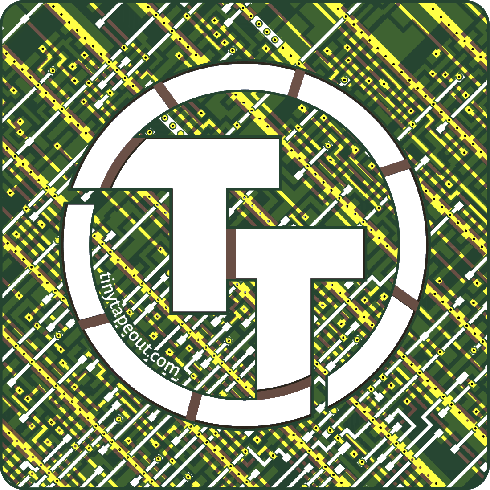
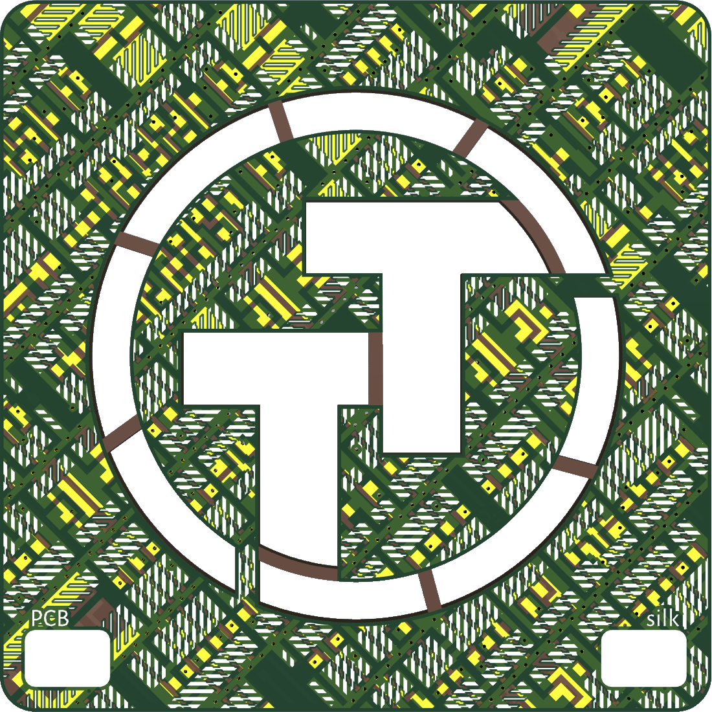

# TT coaster

* script to generate an artistic PCB from a portion of a GDS file
* example design based on the Tiny Tapeout 6 GDS (showcasing a piece of Leo Moser's Tiny Shader)

front view:

back view:

